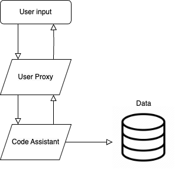

# Project Title

## Overview

This project utilizes the OpenAI GPT-4 model and the Instructor library to create a code assistant capable of executing Python scripts and interacting with log data. The assistant is designed to handle user requests related to coding tasks, including the creation and execution of Python files. Additionally, the assistant can communicate with a user proxy agent to facilitate a streamlined dialogue between the user and specialized agents.

## Project Structure

The architecture includes two primary agents: the Code Assistant and the User Proxy Agent. These agents are designed to work together to facilitate interactions between a user and the OpenAI GPT-4 model for code assistance. Let's delve into the roles and functionalities of each agent:

### Code Assistant

The Code Assistant is an instance of the OpenAI GPT-4 model trained to assist with Python programming tasks. Its main features include:

1. **Execution of Python Code:**
   - The assistant can execute Python scripts provided by the user using the `ExecutePyFile` class. It runs the scripts and returns the output or any errors encountered during execution.

2. **File Creation and Editing:**
   - The assistant can create Python files using the `File` class. Users can specify the filename and provide the code content. The assistant then creates the file with the specified content.

3. **Interaction with Log Data:**
   - The assistant is equipped to interact with log data, although the specific functionalities related to log data are not fully detailed in the provided code snippet.

### User Proxy Agent

The User Proxy Agent serves as a bridge between the user and specialized agents like the Code Assistant. Its responsibilities include:

1. **Streamlining Dialogue:**
   - The User Proxy Agent streamlines the dialogue between the user and specialized agents within the group chat. It interprets user requests and communicates them accurately to the relevant agents.

2. **Communication with Code Assistant:**
   - The assistant can communicate with the Code Assistant Agent using the `SendMessage` class. It can send messages to the Code Assistant Agent.

3. **Ongoing Communication:**
   - The User Proxy Agent maintains ongoing communication with the specialized agents until the task is complete, an error is reported, or a certain response is certain.

4. **Message Relay:**
   - It relays messages from the user to the appropriate agents, ensuring that user requests are properly understood and executed by the specialized agents.

5. **Avoiding Premature Responses:**
   - The agent refrains from responding to the user until the task is complete, an error is reported, or there is certainty in the response.

## Custom Tools

1. **ExecutePyFile**: Executes a Python script at the given file path and captures its output and errors.

2. **File**: Creates a Python file with a specified name and contents.

3. **SendMessage**: Sends messages to other specialized agents in the group chat, facilitating communication between agents.
